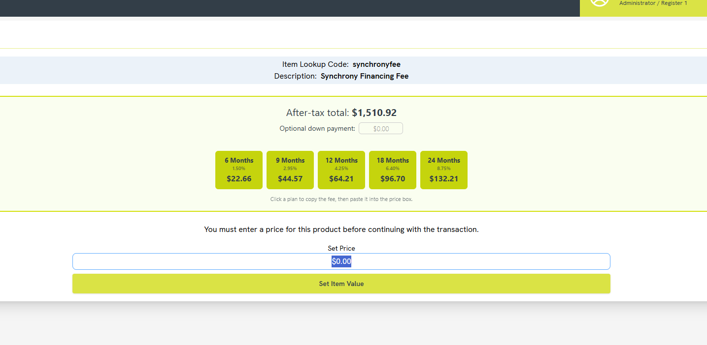
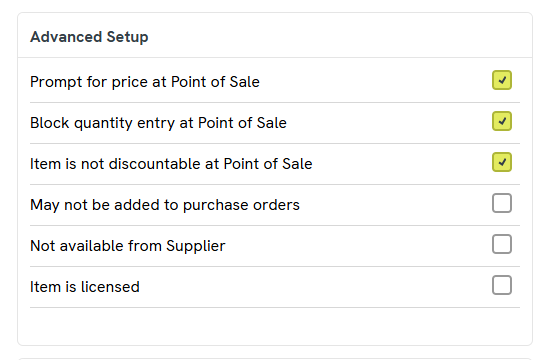

# Synchrony Financing Fee Calculator

A small Chrome extension that adds a financing-fee helper to the
[Citrus-Lime Cloud POS](https://pos2.citruslime.com) **Set Price** screen.

When you ring up the `synchronyfee` item, the extension reads the transaction's
after-tax total, calculates the Synchrony fee for each financing plan, and lets
you copy the right amount to the clipboard with one click. You then paste it
into the price box and complete the sale.

## Why clipboard instead of auto-fill?

The price field is a production Vue (`vue-currency-input`) control whose internal
value can't be set reliably from a browser extension — programmatic changes don't
commit and the field submits `$0`. Copying to the clipboard keeps the cashier in
control of the actual value and avoids submitting a wrong amount.

## Features

- Reads the after-tax total straight from the cart.
- Optional **down payment** field — the fee is calculated on the remaining
  balance (total − down payment).
- One button per plan, each showing the term, rate, and calculated fee.
- Click a plan to copy its fee to the clipboard (with a "Copied!" confirmation).
- Only appears on the Synchrony fee Set Price screen; stays out of the way
  everywhere else.

## Financing plans

| Term      | Rate  |
|-----------|-------|
| 6 months  | 1.50% |
| 9 months  | 2.95% |
| 12 months | 4.25% |
| 18 months | 6.40% |
| 24 months | 8.75% |

To change a plan or rate, edit the `PLANS` array near the top of `content.js`.

## Set up the POS item

The extension keys off a single POS item. Before installing, create it in
Cloud POS:

1. Create a new **non-inventory** item.
2. Set the **description** to `Synchrony Financing Fee`.
3. Set the **item lookup code** to `synchronyfee`.
4. Under **Advanced Setup**, enable these options:
   - **Prompt for price at Point of Sale** — this is what opens the Set Price
     screen where the overlay appears.
   - **Block quantity entry at Point of Sale**
   - **Item is not discountable at Point of Sale**

   Leave the rest unchecked.

The description and lookup code both contain "synchrony", which is how the
extension recognizes the screen. If you use a different description or code,
update `matchKeyword` in the `CONFIG` block of `content.js` to match.

## Installation

1. Download or clone this repository.
2. Open `chrome://extensions` in Chrome.
3. Turn on **Developer mode** (top-right toggle).
4. Click **Load unpacked** and select this folder.

The extension activates automatically on `pos2.citruslime.com`.

## Usage

1. Add the customer's items to the cart so the total is calculated.
2. Scan or add the `synchronyfee` item to open the Set Price screen.
3. (Optional) Enter a down payment to finance only the remaining balance.
4. Click the plan the customer chose — the fee is copied to your clipboard.
5. Paste it into the price box and click **Set Item Value**.

## Files

- `manifest.json` — extension manifest (Manifest V3).
- `content.js` — builds the overlay, runs the calculations, copies to clipboard.

## Notes

- Rates are hardcoded; update `content.js` if Synchrony's fee schedule changes.
- The fee is copied as a plain number (e.g. `3.21`) with no currency symbol, so
  it pastes cleanly into the price field.
